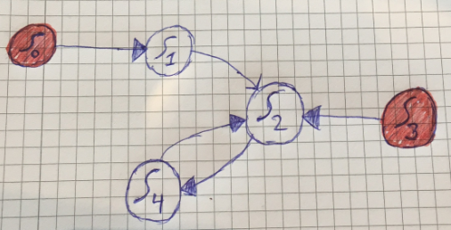
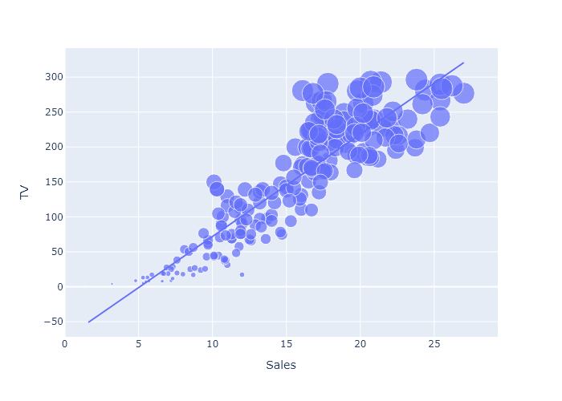
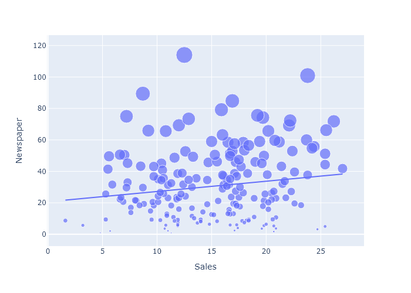
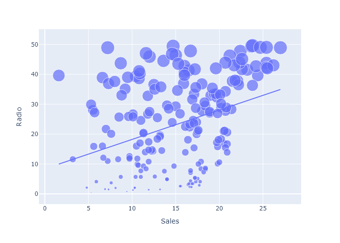

# Relational Analysis & Visualization 📊

> Advanced Sales Prediction System using Machine Learning and Interactive Data Visualization

[](https://www.python.org/)
[](https://plotly.com/)
[](https://scikit-learn.org/)
[](LICENSE)


## 📑 Table of Contents
- [Relational Analysis \& Visualization 📊](#relational-analysis--visualization-)
  - [📑 Table of Contents](#-table-of-contents)
  - [🎯 Overview](#-overview)
  - [✨ Features](#-features)
  - [🏗 System Architecture](#-system-architecture)
    - [State Flow Explanation](#state-flow-explanation)
    - [Execution Sequence](#execution-sequence)
  - [Output / Generated Artifacts](#output--generated-artifacts)
    - [Television Advertising Impact](#television-advertising-impact)
    - [Newspaper Marketing Performance](#newspaper-marketing-performance)
    - [Radio Campaign Results](#radio-campaign-results)
  - [🚀 Installation](#-installation)
  - [💻 Usage](#-usage)
  - [🔧 Technical Details](#-technical-details)
    - [Data Flow](#data-flow)
    - [Technology Stack](#technology-stack)
  - [🔗 Related Projects](#-related-projects)


## 🎯 Overview

This advanced analytics project leverages machine learning to predict product sales, optimizing manufacturing and advertising costs. Built in June 2024, it combines Linear Regression modeling with sophisticated data visualization techniques using Plotly, offering both static and interactive insights into sales patterns.

## ✨ Features

- **Predictive Analytics**: Linear Regression model for sales forecasting
- **Dual Visualization Formats**:
  - 📸 Static PNG outputs for quick insights
  - 🔄 Interactive HTML reports for detailed analysis
- **Automated Workflow**: Single-command execution with state management
- **Historical Comparison**: Automatic tracking of previous analyses

## 🏗 System Architecture

The project follows a state-machine architecture for reliable data processing and output management:



### State Flow Explanation

| State | Description | Function |
|-------|-------------|----------|
| S0 | Initial Execution | First-time repository run |
| S1 | Setup Phase | No existing output verification |
| S2 | Generation Phase | Creates new visualization outputs |
| S3 | Comparison Phase | Analyzes current vs. previous results |
| S4 | Storage Phase | Archives current outputs |

### Execution Sequence

You need to run the project by typing `./run.sh` in your terminal. This script invokes the following sequential steps:
    - 1: Store previous outputs from the latest execution of the project in "/output-previous" directory
    - 2: Remove the content stored in "/output-current" directory
    - 3: Generate new output in "/output-current" directory


**Explanation:**
    - Each state or node in the picture represents a unique state in the execution of this repository
    - States:
        - S0: Run repository for the first time by running "./run.sh"
        - S1: First time running the repository. No generated output in "/output-current". This implies that the code can't generate a previous output backup/comparison
        - S2: The repository was successfully executed and the output files in "/output-current" was generated
        - S3: Run repository for the (n + 1)th time, where n >= 1. There is now generated files in "/output-current" such that the code can generate the comparative .txt files in "/output-previous" directory
        - S4: Store the "current" output files as .txt files in the (n + 1)th time, n >= 1
    
    - Given the explanation above, the sequence of the visited states for the users is predictable:
        - First iteration: S0, S1, S2, S3, S4
        - (N + 1)th iteration, N >= 1: S2, S4
        - Final conclusion: S0, S1, S2, S3, S4, S2, S4, S2, S4, S2, S4, ..., (S2, S4) * N
        - Simplified conclusion: S0, S1, S2, S3, S4, ((S2, S4) * N)
        


## Output / Generated Artifacts

### Television Advertising Impact


*Correlation between TV advertising investment and units sold*

### Newspaper Marketing Performance


*Impact of newspaper advertising on sales metrics*

### Radio Campaign Results


*Effectiveness of radio advertising campaigns*

## 🚀 Installation

1. **Prerequisites**
   ```bash
   python -m pip install pandas plotly kaleido
   ```

2. **Windows-Specific Setup**
   ```bash
   pip install --upgrade kaleido=="0.1.0.post1"
   ```

## 💻 Usage

Execute the analysis pipeline with a single command:
```bash
./run.sh
```

This will:
1. Archive previous results
2. Clear current output directory
3. Generate new visualizations
4. Store results in `/output-current`

## 🔧 Technical Details

### Data Flow
- **Input**: CSV data from `/dataset`
- **Output**: 
  - `/output-current`: Latest analysis results
  - `/output-previous`: Historical analysis archive

### Technology Stack
- **Analysis**: Python, Pandas
- **Visualization**: Plotly
- **Export**: Kaleido
- **Version Control**: Git

## 🔗 Related Projects

- [Cyber Physical Systems of Systems](https://github.com/mrjex/Cyber-Physical-Systems-and-Sytems-of-Systems)
- [Bookster](https://github.com/mrjex/Bookster)

---

*Built with 💻 and 📊 by Joel Mattsson*